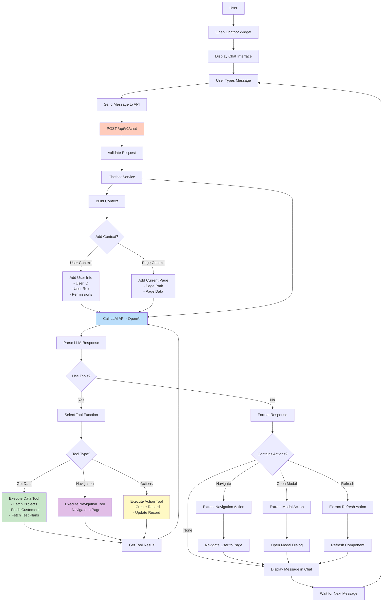
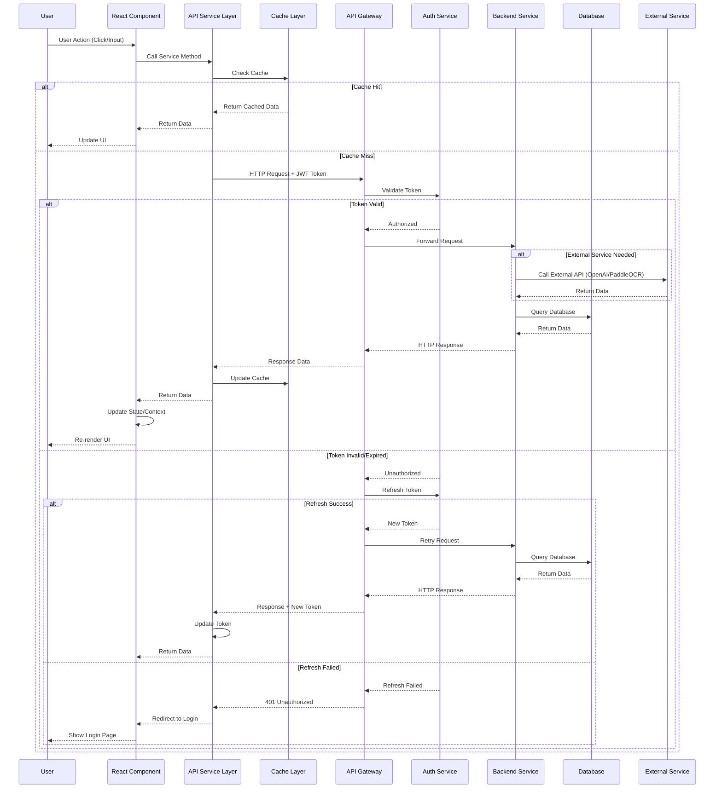
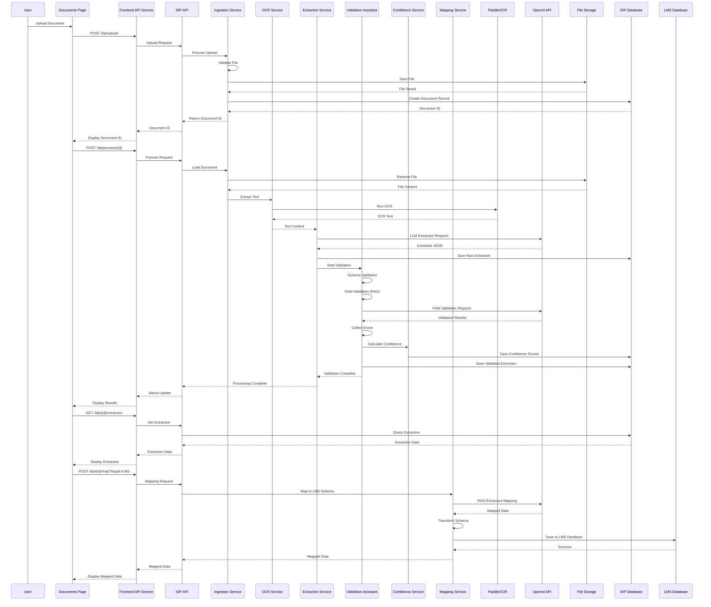
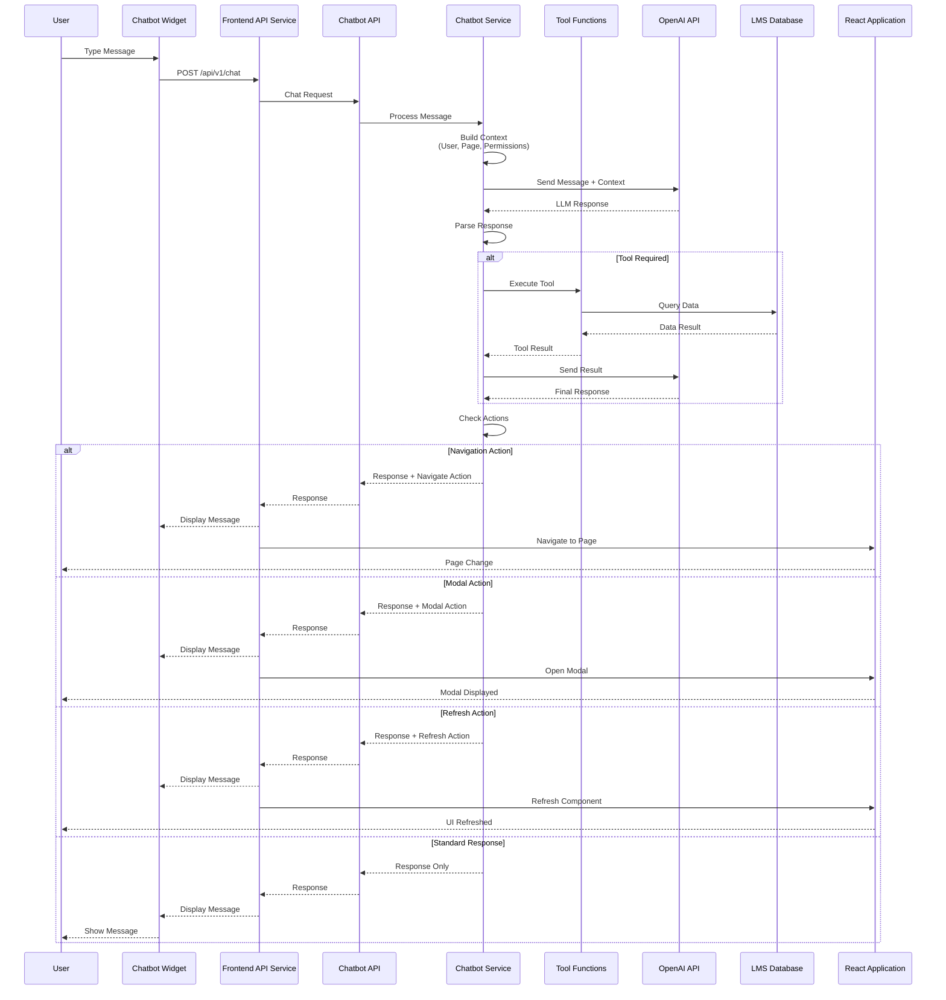
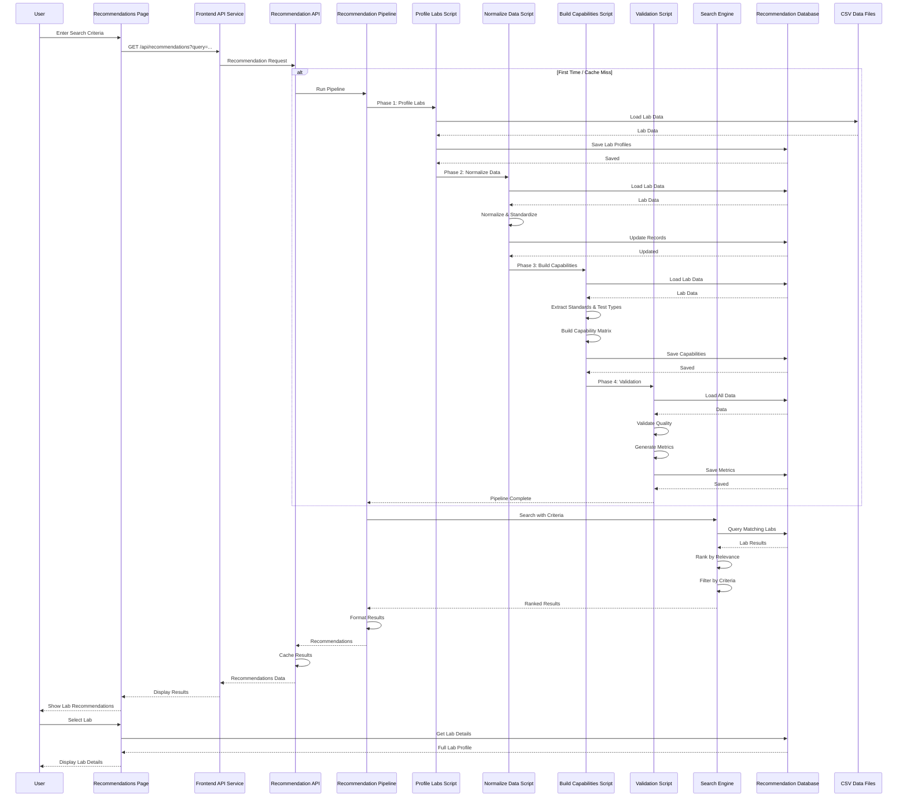

# Lab Management System (LMS) - Complete Application Flowchart

This document provides a comprehensive flowchart diagram of the entire Lab Management System application, focusing on core features: Document Processing (with Validation Assistant), Chatbot, and Lab Recommendation Engine.

## System Overview Flowchart

```mermaid
flowchart TB
    Start([User Access]) --> Auth{Authenticated?}
    Auth -->|No| Login[Login Page]
    Auth -->|Yes| Dashboard[Dashboard]
    
    Login --> LoginAPI[POST /api/v1/auth/login]
    LoginAPI -->|Success| StoreToken[Store JWT Token]
    StoreToken --> Dashboard
    
    Dashboard --> Nav{User Navigation}
    
    %% Core LMS Features
    Nav -->|Customers| CustomerPage[Customers Page]
    CustomerPage --> CustomerAPI[GET/POST/PUT/DELETE /api/customers]
    CustomerAPI --> MainDB[(Main LMS Database)]
    
    Nav -->|Projects| ProjectPage[Projects Page]
    ProjectPage --> ProjectAPI[GET/POST/PUT/DELETE /api/projects]
    ProjectAPI --> MainDB
    
    Nav -->|Test Plans| TestPlanPage[Test Plans Page]
    TestPlanPage --> TestPlanAPI[/api/test-plans]
    TestPlanAPI --> MainDB
    
    Nav -->|Test Executions| TestExecPage[Test Executions Page]
    TestExecPage --> TestExecAPI[/api/test-executions]
    TestExecAPI --> MainDB
    
    Nav -->|Test Results| TestResultPage[Test Results Page]
    TestResultPage --> TestResultAPI[/api/test-results]
    TestResultAPI --> MainDB
    
    %% Document Processing with Validation Assistant
    Nav -->|Documents| DocumentPage[Documents Page]
    DocumentPage --> DocUpload{Upload Document?}
    DocUpload -->|Yes| IDPUpload[POST /idp/upload]
    IDPUpload --> IDPValidate[Validate File Type/Size]
    IDPValidate -->|Valid| IDPStorage[(Document Storage)]
    IDPValidate -->|Invalid| IDPError[Reject with Error]
    
    IDPStorage --> IDPProcess[POST /idp/process/{document_id}]
    IDPProcess --> IDPOCR[OCR Processing - PaddleOCR]
    IDPOCR --> IDPExtract[LLM Extraction - OpenAI GPT-4]
    IDPExtract --> ValidationAssistant[Validation Assistant]
    
    ValidationAssistant --> ValidateSchema[Schema Validation]
    ValidateSchema --> ValidateField[Field-Level Validation]
    ValidateField --> ValidateReasoning[RAG-Enhanced Reasoning]
    ValidateReasoning --> ConfidenceCalc[Calculate Confidence Scores]
    ConfidenceCalc --> IDPDB[(IDP Database)]
    
    IDPDB --> IDPExtractGet[GET /idp/{document_id}/extraction]
    IDPExtractGet --> IDPConfidence[GET /idp/{document_id}/confidence]
    IDPConfidence --> CheckMapping{Map to LMS?}
    CheckMapping -->|Yes| IDPMap[POST /idp/{document_id}/map?target=LMS]
    IDPMap --> LMSIntegration[Integrate with LMS Data]
    LMSIntegration --> MainDB
    
    %% Lab Recommendation Engine
    Nav -->|Lab Recommendations| RecoPage[Lab Recommendations Page]
    RecoPage --> UserQuery[User Query/Selection]
    UserQuery --> RecoAPI[Lab Recommendation API]
    RecoAPI --> RecoEngine[Recommendation Engine]
    
    RecoEngine --> Phase1[Phase 1: Profile Labs]
    Phase1 --> Phase2[Phase 2: Normalize Data]
    Phase2 --> Phase3[Phase 3: Build Capabilities]
    Phase3 --> Phase4[Phase 4: Validation]
    Phase4 --> SearchLabs[Search Matching Labs]
    SearchLabs --> RankResults[Rank by Relevance]
    RankResults --> RecoDB[(Lab Recommendation DB)]
    RecoDB --> DisplayResults[Display Results in UI]
    
    %% Chatbot Flow
    Dashboard -.->|User Interaction| ChatbotWidget[Chatbot Widget]
    ChatbotWidget --> ChatbotAPI[POST /api/v1/chat]
    ChatbotAPI --> ChatbotService[Chatbot Service]
    ChatbotService --> ChatbotLLM[LLM API Call - OpenAI]
    ChatbotLLM --> ToolCheck{Tool Needed?}
    ToolCheck -->|Yes| ToolExecute[Execute Tool Function]
    ToolCheck -->|No| ChatbotResponse[Generate Response]
    ToolExecute --> ChatbotResponse
    ChatbotResponse --> ChatbotWidget
    
    ChatbotWidget --> ChatbotAction{Action Type?}
    ChatbotAction -->|Navigate| NavigatePage[Navigate to Page]
    ChatbotAction -->|Open Modal| OpenModal[Open Modal]
    ChatbotAction -->|Refresh| RefreshPage[Refresh Page]
    
    %% Organization & Scope Management
    Nav -->|Organization| OrgPage[Organization Details Page]
    OrgPage --> OrgAPI[/api/organization]
    OrgAPI --> MainDB
    
    Nav -->|Scope Management| ScopePage[Scope Management Page]
    ScopePage --> ScopeAPI[/api/scope]
    ScopeAPI --> MainDB
    
    %% Calendar
    Nav -->|Calendar| CalendarPage[Calendar Page]
    CalendarPage --> CalendarAPI[/api/calendar]
    CalendarAPI --> MainDB
    
    %% Error Handling
    CustomerAPI -->|Error| ErrorHandler[Error Handler]
    ProjectAPI -->|Error| ErrorHandler
    IDPUpload -->|Error| ErrorHandler
    ChatbotAPI -->|Error| ErrorHandler
    RecoAPI -->|Error| ErrorHandler
    ErrorHandler --> ErrorToast[Show Error Toast]
    ErrorToast --> Dashboard
    
    %% Logout Flow
    Dashboard --> Logout{Logout?}
    Logout -->|Yes| LogoutAPI[POST /api/v1/auth/logout]
    LogoutAPI --> ClearToken[Clear JWT Token]
    ClearToken --> Start
    
    style Start fill:#e1f5ff
    style Dashboard fill:#c8e6c9
    style IDPUpload fill:#fff9c4
    style IDPProcess fill:#fff9c4
    style ValidationAssistant fill:#ff9800,color:#fff
    style ChatbotWidget fill:#ffccbc
    style RecoEngine fill:#f3e5f5
    style ErrorHandler fill:#ffcdd2
```

## Detailed Component Flows

### 1. Document Processing with Validation Assistant Flow

```mermaid
flowchart TD
    Start([Document Upload Request]) --> UploadDoc[POST /idp/upload]
    UploadDoc --> ValidateFile[Validate File Type/Size]
    ValidateFile -->|Invalid| RejectFile[Reject with Error]
    ValidateFile -->|Valid| SaveFile[Save to Storage]
    SaveFile --> CreateDocRecord[Create Document Record]
    CreateDocRecord --> ReturnDocID[Return Document ID]
    
    ReturnDocID --> ProcessRequest{Process Document?}
    ProcessRequest -->|Yes| ProcessDoc[POST /idp/process/{document_id}]
    
    ProcessDoc --> LoadFile[Load Document from Storage]
    LoadFile --> PDFExtract[Extract PDF Pages/Text]
    PDFExtract --> OCRProcess[Run OCR - PaddleOCR]
    OCRProcess --> CombineText[Combine OCR Text]
    
    CombineText --> LLMExtract[LLM Extraction - OpenAI GPT-4]
    LLMExtract --> ParseJSON[Parse Extracted JSON]
    ParseJSON --> ExtractionDB[(Save Raw Extraction)]
    
    ExtractionDB --> ValidationAssistant[Validation Assistant Service]
    
    %% Validation Assistant Process
    ValidationAssistant --> SchemaValidation[JSON Schema Validation]
    SchemaValidation -->|Invalid| SchemaErrors[Collect Schema Errors]
    SchemaValidation -->|Valid| FieldValidation[Field-Level Validation]
    
    FieldValidation --> ForEachField{For Each Field}
    ForEachField --> RAGRetrieval[Retrieve RAG Context]
    RAGRetrieval --> RAGValidation[RAG-Enhanced Validation]
    RAGValidation --> FieldReasoning[Field Reasoning & Normalization]
    FieldReasoning --> ValidationResult[Validation Result]
    
    ValidationResult --> CheckValid{Valid?}
    CheckValid -->|No| CollectErrors[Collect Validation Errors]
    CheckValid -->|Yes| NextField{More Fields?}
    CollectErrors --> NextField
    NextField -->|Yes| ForEachField
    NextField -->|No| ConfidenceService[Confidence Calculation Service]
    
    SchemaErrors --> ConfidenceService
    ConfidenceService --> CalculateFieldConfidence[Calculate Field Confidence Scores]
    CalculateFieldConfidence --> CalculateOverallConfidence[Calculate Overall Confidence]
    CalculateOverallConfidence --> SaveConfidence[(Save Confidence Scores)]
    
    SaveConfidence --> SaveExtraction[(Save Validated Extraction)]
    SaveExtraction --> ValidationSummary[Generate Validation Summary]
    
    ValidationSummary --> GetExtraction[GET /idp/{document_id}/extraction]
    GetExtraction --> GetConfidence[GET /idp/{document_id}/confidence]
    
    GetConfidence --> CheckMapping{Map to LMS?}
    CheckMapping -->|Yes| MapToLMS[POST /idp/{document_id}/map?target=LMS]
    MapToLMS --> MappingService[Mapping Service]
    MappingService --> RAGMapping[RAG-Enhanced Mapping]
    RAGMapping --> TransformData[Transform to LMS Schema]
    TransformData --> ValidateMapping[Validate Mapped Data]
    ValidateMapping --> SaveMappedData[(Save to LMS Database)]
    SaveMappedData --> ReturnMapped[Return Mapped Data]
    
    CheckMapping -->|No| ReturnExtraction[Return Extraction Only]
    
    ReturnMapped --> End([End - Data Ready in LMS])
    ReturnExtraction --> End
    RejectFile --> End
    
    style OCRProcess fill:#fff9c4
    style LLMExtract fill:#bbdefb
    style ValidationAssistant fill:#ff9800,color:#fff
    style RAGValidation fill:#e1bee7
    style ConfidenceService fill:#c8e6c9
    style MapToLMS fill:#c8e6c9
    style RejectFile fill:#ffcdd2
```

### 2. Validation Assistant Detailed Flow

```mermaid
flowchart LR
    Start([Validation Request]) --> InputData[Input: Extracted Data + Document ID]
    InputData --> ValidationService[Validation Assistant Service]
    
    ValidationService --> Step1[Step 1: JSON Schema Validation]
    Step1 --> SchemaValidator[JSON Schema Validator]
    SchemaValidator --> SchemaResult{Valid?}
    SchemaResult -->|No| SchemaErrorList[Schema Error List]
    SchemaResult -->|Yes| Step2[Step 2: Field-Level Validation]
    
    Step2 --> FieldIterator[Iterate Through Fields]
    FieldIterator --> FieldValue[Get Field Value]
    FieldValue --> RAGQuery[Query RAG Knowledge Base]
    
    RAGQuery --> RetrieveContext[Retrieve Validation Context]
    RetrieveContext --> BuildPrompt[Build Validation Prompt]
    BuildPrompt --> LLMValidation[Call Reasoning LLM GPT-4-mini]
    
    LLMValidation --> ParseResponse[Parse LLM Response]
    ParseResponse --> ValidationResult{Validation Result}
    
    ValidationResult -->|Valid| NormalizeValue[Normalize Value if Needed]
    ValidationResult -->|Invalid| ValidationErrors[Collect Validation Errors]
    NormalizeValue --> FieldSuggestion[Generate Suggestions]
    
    ValidationErrors --> FieldSuggestion
    FieldSuggestion --> NextField{More Fields?}
    NextField -->|Yes| FieldIterator
    NextField -->|No| Step3[Step 3: Confidence Calculation]
    
    SchemaErrorList --> Step3
    
    Step3 --> ConfidenceService[Confidence Service]
    ConfidenceService --> FieldConfidence[Calculate Field Confidence]
    FieldConfidence --> OverallConfidence[Calculate Overall Confidence]
    OverallConfidence --> GenerateReport[Generate Validation Report]
    
    GenerateReport --> ReturnReport[Return Validation Report]
    ReturnReport --> End([End: Validation Complete])
    
    style ValidationService fill:#ff9800,color:#fff
    style LLMValidation fill:#bbdefb
    style ConfidenceService fill:#c8e6c9
    style SchemaValidator fill:#fff9c4
```



### 3. Chatbot Interaction Flow



### 4. Lab Recommendation Engine Flow

```mermaid
flowchart TD
    Start([Lab Recommendation Request]) --> RecoPage[Lab Recommendations Page]
    RecoPage --> UserQuery[User Query/Selection<br/>- Standards<br/>- Test Types<br/>- Location<br/>- Criteria]
    UserQuery --> RecoAPI[Call Recommendation API]
    
    RecoAPI --> CheckCache{Cached Result?}
    CheckCache -->|Yes| ReturnCached[Return Cached Result]
    CheckCache -->|No| RunPipeline[Run Recommendation Pipeline]
    
    RunPipeline --> Phase1[Phase 1: Profile Labs]
    Phase1 --> LoadLabData[Load Lab Data from CSV Files]
    LoadLabData --> ProcessLabData[Process Lab Information<br/>- Parse Lab Details<br/>- Extract Metadata<br/>- Clean Data]
    ProcessLabData --> SaveProfiles[(Save Lab Profiles to DB)]
    
    SaveProfiles --> Phase2[Phase 2: Normalize Data]
    Phase2 --> NormalizeRows[Normalize Lab Data Rows]
    NormalizeRows --> StandardizeData[Standardize Formats<br/>- Standard Names<br/>- Date Formats<br/>- Location Codes]
    StandardizeData --> UpdateDB[(Update Database Records)]
    
    UpdateDB --> Phase3[Phase 3: Build Capabilities]
    Phase3 --> ExtractStandards[Extract Standards/Test Types<br/>- ISO Standards<br/>- Test Categories<br/>- Capabilities]
    ExtractStandards --> BuildCapabilityMatrix[Build Capability Matrix<br/>- Lab → Standards Mapping<br/>- Lab → Test Types Mapping]
    BuildCapabilityMatrix --> CreateIndexes[Create Search Indexes<br/>- Full-Text Search<br/>- Vector Search]
    
    CreateIndexes --> Phase4[Phase 4: Validation]
    Phase4 --> ValidateData[Validate Data Quality<br/>- Completeness Check<br/>- Consistency Check<br/>- Accuracy Check]
    ValidateData --> GenerateMetrics[Generate Quality Metrics<br/>- Coverage Score<br/>- Completeness Score<br/>- Reliability Score]
    
    GenerateMetrics --> SearchLabs[Search Matching Labs]
    SearchLabs --> MatchCriteria[Match User Criteria]
    MatchCriteria --> FilterResults[Filter by Criteria<br/>- Location<br/>- Standards<br/>- Test Types<br/>- Availability]
    
    FilterResults --> RankResults[Rank by Relevance<br/>- Relevance Score<br/>- Capability Match<br/>- Quality Score]
    RankResults --> FormatResults[Format Results<br/>- Lab Details<br/>- Match Reasons<br/>- Capabilities]
    
    FormatResults --> CacheResults[Cache Results]
    CacheResults --> ReturnResults[Return Recommendations]
    ReturnCached --> ReturnResults
    
    ReturnResults --> DisplayResults[Display in UI<br/>- Lab Cards<br/>- Match Scores<br/>- Capabilities List]
    DisplayResults --> UserSelection{User Selects Lab?}
    UserSelection -->|Yes| LabDetail[Show Lab Details<br/>- Full Profile<br/>- Test Capabilities<br/>- Contact Info<br/>- Certifications]
    UserSelection -->|No| Start
    
    style RunPipeline fill:#f3e5f5
    style SearchLabs fill:#c8e6c9
    style RankResults fill:#e1bee7
    style ReturnResults fill:#bbdefb
```



### 5. Complete Data Flow Diagram

```mermaid
flowchart TB
    subgraph "User Layer"
        User[User Browser]
        UserActions[User Actions<br/>- Clicks<br/>- Form Inputs<br/>- File Uploads]
    end
    
    subgraph "Frontend Layer (React)"
        UI[React UI Components]
        Pages[Page Components<br/>- Dashboard<br/>- Documents<br/>- Recommendations]
        Services[API Service Layer<br/>- labManagementApi.js<br/>- Request/Response Interceptors]
        Context[React Context<br/>- Auth Context<br/>- Data Context]
        State[Component State]
    end
    
    subgraph "API Gateway Layer"
        APIGateway[API Gateway<br/>FastAPI Backend]
        AuthService[Authentication Service<br/>- JWT Validation<br/>- Token Refresh]
        RequestInterceptor[Request Interceptor<br/>- Add Headers<br/>- Log Requests]
        ResponseInterceptor[Response Interceptor<br/>- Error Handling<br/>- Token Refresh]
    end
    
    subgraph "Document Processing Service (IDP)"
        IDPAPI[IDP API Endpoints<br/>- /idp/upload<br/>- /idp/process/{id}<br/>- /idp/{id}/extraction<br/>- /idp/{id}/confidence<br/>- /idp/{id}/map]
        IngestionService[Ingestion Service<br/>- File Validation<br/>- Storage]
        OCRService[OCR Service<br/>- PaddleOCR Integration]
        ExtractionService[Extraction Service<br/>- LLM Extraction<br/>- JSON Parsing]
        ValidationService[Validation Assistant<br/>- Schema Validation<br/>- Field Validation<br/>- RAG Validation]
        ConfidenceService[Confidence Service<br/>- Field Confidence<br/>- Overall Confidence]
        MappingService[Mapping Service<br/>- RAG Mapping<br/>- Schema Transformation]
    end
    
    subgraph "Chatbot Service"
        ChatbotAPI[Chatbot API<br/>POST /api/v1/chat]
        ChatbotService[Chatbot Service<br/>- Context Building<br/>- Tool Selection]
        ChatbotTools[Tool Functions<br/>- Get Data<br/>- Navigation<br/>- Actions]
    end
    
    subgraph "Lab Recommendation Engine"
        RecoAPI[Recommendation API<br/>GET /api/recommendations]
        RecoPipeline[Recommendation Pipeline<br/>- Profile Labs<br/>- Normalize Data<br/>- Build Capabilities<br/>- Validation]
        RecoSearch[Search Engine<br/>- Full-Text Search<br/>- Vector Search]
    end
    
    subgraph "External Services"
        OpenAI[OpenAI API<br/>- GPT-4 (Extraction)<br/>- GPT-4-mini (Reasoning)<br/>- GPT-4 (Chatbot)]
        PaddleOCR[PaddleOCR<br/>- OCR Processing]
    end
    
    subgraph "Data Storage Layer"
        MainDB[(Main LMS Database<br/>PostgreSQL<br/>- Customers<br/>- Projects<br/>- Test Plans<br/>- Results)]
        IDPDB[(IDP Database<br/>PostgreSQL + pgvector<br/>- Documents<br/>- Extractions<br/>- Confidence Scores<br/>- RAG Vectors)]
        RecoDB[(Lab Recommendation DB<br/>PostgreSQL<br/>- Lab Profiles<br/>- Capabilities<br/>- Standards)]
        VectorDB[(Vector Database<br/>pgvector<br/>- RAG Embeddings<br/>- Schema Vectors)]
        FileStorage[(File Storage<br/>- PDF Files<br/>- Images<br/>- Documents)]
        Cache[(Cache Layer<br/>- In-Memory Cache<br/>- 30s TTL)]
    end
    
    %% User to Frontend Flow
    User --> UserActions
    UserActions --> UI
    UI --> Pages
    Pages --> Services
    Services --> Context
    Context --> State
    State --> UI
    
    %% Frontend to API Gateway Flow
    Services -->|HTTP Requests<br/>+ JWT Token| APIGateway
    APIGateway --> RequestInterceptor
    RequestInterceptor --> AuthService
    AuthService -->|Valid| ResponseInterceptor
    AuthService -->|Invalid| ResponseInterceptor
    
    %% API Gateway to Services Flow
    ResponseInterceptor -->|Document Requests| IDPAPI
    ResponseInterceptor -->|Chat Requests| ChatbotAPI
    ResponseInterceptor -->|Recommendation Requests| RecoAPI
    ResponseInterceptor -->|Standard CRUD| MainDB
    
    %% IDP Service Flow
    IDPAPI --> IngestionService
    IngestionService --> FileStorage
    IngestionService --> OCRService
    OCRService --> PaddleOCR
    OCRService --> ExtractionService
    ExtractionService --> OpenAI
    ExtractionService --> ValidationService
    ValidationService --> VectorDB
    ValidationService --> OpenAI
    ValidationService --> ConfidenceService
    ConfidenceService --> IDPDB
    ValidationService --> MappingService
    MappingService --> VectorDB
    MappingService --> OpenAI
    MappingService --> MainDB
    
    %% Chatbot Service Flow
    ChatbotAPI --> ChatbotService
    ChatbotService --> OpenAI
    ChatbotService --> ChatbotTools
    ChatbotTools --> MainDB
    ChatbotTools --> APIGateway
    
    %% Recommendation Engine Flow
    RecoAPI --> RecoPipeline
    RecoPipeline --> RecoDB
    RecoPipeline --> RecoSearch
    RecoSearch --> RecoDB
    RecoPipeline --> MainDB
    
    %% Cache Layer
    Services -->|Check Cache| Cache
    Cache -->|Hit| Services
    Cache -->|Miss| APIGateway
    
    %% Response Flow
    MainDB -->|Data| ResponseInterceptor
    IDPDB -->|Data| ResponseInterceptor
    RecoDB -->|Data| ResponseInterceptor
    ChatbotAPI -->|Response| ResponseInterceptor
    IDPAPI -->|Response| ResponseInterceptor
    RecoAPI -->|Response| ResponseInterceptor
    
    ResponseInterceptor -->|HTTP Response| Services
    Services -->|Update State| Context
    Context -->|Re-render| UI
    UI --> User
    
    style User fill:#e3f2fd
    style Services fill:#bbdefb
    style APIGateway fill:#c8e6c9
    style IDPAPI fill:#fff9c4
    style ValidationService fill:#ff9800,color:#fff
    style ChatbotAPI fill:#ffccbc
    style RecoAPI fill:#f3e5f5
    style OpenAI fill:#e1bee7
    style MainDB fill:#b2dfdb
    style IDPDB fill:#b2dfdb
    style RecoDB fill:#b2dfdb
    style VectorDB fill:#b2dfdb
    style FileStorage fill:#b2dfdb
    style Cache fill:#ffecb3
```

### 6. Detailed Data Flow - Request/Response Cycle



### 7. Data Flow for Document Processing



### 8. Data Flow for Chatbot



### 9. Data Flow for Lab Recommendations



## Application Architecture Summary

### Core Features Included
1. **Document Processing (IDP)** with Validation Assistant
   - OCR processing using PaddleOCR
   - LLM extraction using OpenAI GPT-4
   - Validation Assistant with schema validation, field validation, and RAG-enhanced reasoning
   - Confidence scoring
   - Schema mapping to LMS

2. **Chatbot Service**
   - AI-powered chatbot with OpenAI integration
   - Tool execution capabilities
   - Context-aware responses
   - Action handling (navigation, modals, refresh)

3. **Lab Recommendation Engine**
   - Multi-phase data pipeline (Profile, Normalize, Build Capabilities, Validate)
   - Advanced search and ranking
   - Capability matching
   - Quality metrics

### Excluded Features
- **NAI folder**: Excluded from main application flow
- **AI Integration Page**: Removed from navigation and flows

### Data Flow Patterns
- **Request Flow**: User → React Component → Service Layer → API Gateway → Backend Service → Database/External Service
- **Response Flow**: Database/External Service → Backend Service → API Gateway → Service Layer → Context/State → React Component → UI
- **Caching**: 30-second TTL for GET requests in-memory cache
- **Error Handling**: Global error interceptors with toast notifications and automatic token refresh
- **Authentication**: JWT-based with automatic token refresh on 401 responses

### Key Integrations
- **OpenAI**: 
  - GPT-4 for document extraction
  - GPT-4-mini for reasoning and validation
  - GPT-4 for chatbot interactions
- **PaddleOCR**: OCR processing for documents
- **PostgreSQL**: Main database with pgvector extension for vector search
- **File Storage**: Document storage system for uploaded files

---

**Note**: These flowcharts represent the complete application architecture focusing on Document Processing with Validation Assistant, Chatbot, and Lab Recommendation Engine. All data flows have been mapped from user interaction through to data persistence, including error handling and alternative flows.
